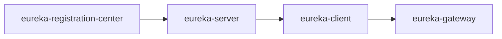

# Spring Boot Netflix Practice

## 项目说明

- eureka-client 消费者
- eureka-gateway 服务网关
- eureka-registration-center 单例注册中心
- eureka-server1 服务实例1
- eureka-server2 服务实例2
- eureka-server-api API定义

## 使用模块

- eureka
- feign
- ribbon
- hystrix
- zuul

## 打包

- `mvn install`
- `mvn clean package -DskipTests`

## 启动顺序

## 例子
- `http://localhost:5555/my-client/client/hello/`
- `http://localhost:5555/my-client/client/server-list`
